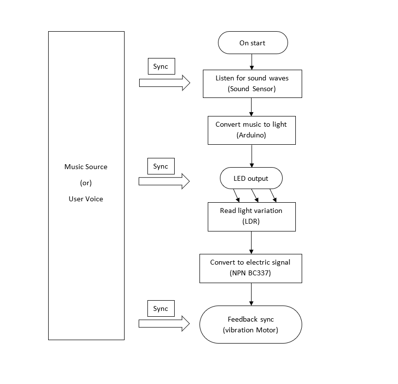
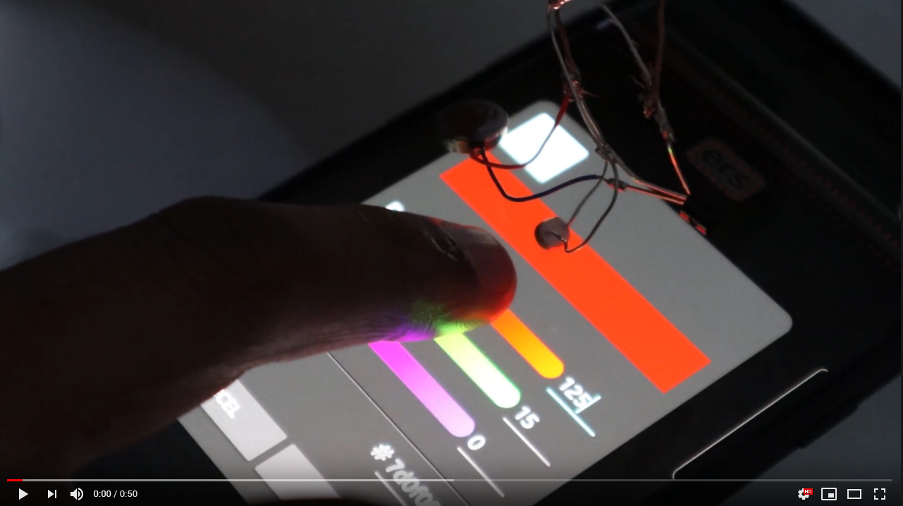
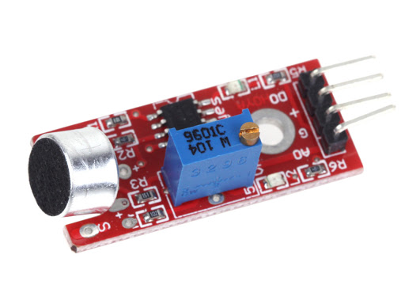
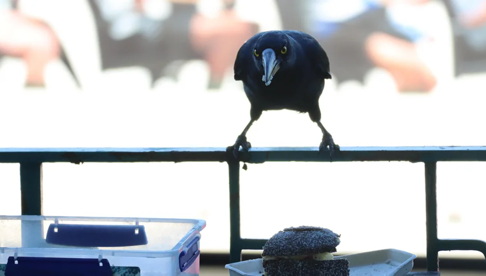

# 7515QCA Final project journal: *Harish Aravind Bakthavatchalam*

<!--- As for other assessments, fill out the following journal sections with information relevant to your project. --->

<!--- Markdown reference: https://guides.github.com/features/mastering-markdown/ --->

## Related projects ##
<!--- Find about 6 related projects to the project you choose. A project might be related through  function, technology, materials, fabrication, concept, or code. Don't forget to place an image of the related project in the appropriate folder and insert the filename in the appropriate places below. Copy the markdown block of code below for each project you are showing. --->
### Related project 1 ###
### *Dexmo Haptic Gloves* ###

*https://www.youtube.com/watch?v=IYf-QAW27ao*

[](https://www.youtube.com/watch?v=IYf-QAW27ao "Dexmo")

This project is related to mine because Dexmo Glove is the kind of product I want to develop. This product gives force feedback for virtual artefacts. My Design Intent aligns with the intention of this product; to interact and feel audio and visual elements through haptic feedback. 

### Related project 2 ###
### *Thermo Real* ###

*https://www.youtube.com/watch?v=hh5gDFKGIrI&t=197s*

[](https://www.youtube.com/watch?v=hh5gDFKGIrI&t=197s "Thermo Real")

This project is related to mine as it is a product that enables us to feel virtual objects. My project started out as an experiment to 'feel' virtual artefacts. Thermoreal allows the user to feel heat, cold and pain in Virtual Reality.

### Related project 3 ###
### *Brushbots* ###

*https://www.youtube.com/watch?v=9JnjOb4Qu0k*

[](https://www.youtube.com/watch?v=9JnjOb4Qu0k "Brushbots")

This project is related to mine because brushbots are the conceptual seed for this whole project. My a part of my project uses a circuit that is very similar to brushbots. My vibrating end of the circuit is derived from adding a Light Dependant Resistor to the circuit. The motor vibrates based on the intensity of the light it receives

### Related project 4 ###
### *DIY LED Music Visualizer* ###

*https://www.youtube.com/watch?v=lU1GVVU9gLU*

[](https://www.youtube.com/watch?v=lU1GVVU9gLU "DIY LED Music Visualizer")

This project is related to mine because I feel that this project is an extrapolation of what the 'music' sensing part of my project would scale up to. While I use a single LED to display light in accordance to the music sensed with Sound sensor, the project uses an Arduino to read music directly and p;ay live animations. I also liked how he records everything as a documentation of his efforts.  

### Related project 5 ###
### *Surrogates* ###

*http://michellevine.com/surrogates/*

[](http://michellevine.com/surrogates/ "Surrogates")

This project is related to mine because the Surrogates is an interesting display of touch based objects. Being someone who is very interested in tactile sensations, displays like these give me a better idea about selecting materials for projects, especially wearable. Seeing the 'Touch Lab' display at QCA, Southbank I was fascinated by how much touch can vary from material to material. This helped me in selecting better materials for my prototype. 

## Other research ##
1. **Arudino Tutorials** - https://www.makerspaces.com/arduino-uno-tutorial-beginners/

Before I set into this project I initially started out with MicroBit where I was fairly familiar with the hardware. Though MicroBit is a powerful microprocessor, I feel that it did not have the flexibility and scale of an Arduino. My learning curve with Arduino was made easier with Makerspaces' tutorial. Now I feel that I could do many more projects with with Arduino.

2.  **The Cognitive and Neural Correlates of Tactile Memory** - https://psycnet.apa.org/record/2009-05290-005

**Reference**: Gallace, A. & Spence, C. (2009). The Cognitive and Neural Correlates of Tactile Memory. Psychological Bulletin, 135(3), 380–406. doi: 10.1037/a0015325.

This paper gave me a better understanding of how tactile feedback is important. Tactile memory is very important touch-based cue in many cultures and relationships. The importance of haptic memory is often understated and underused in our technology. 

3.  **Social Touch Technology: A Survey of Haptic Technology for Social Touch** 

**Reference**: G. Huisman, "Social Touch Technology: A Survey of Haptic Technology for Social Touch," in IEEE Transactions on Haptics, vol. 10, no. 3, pp. 391-408, 1 July-Sept. 2017, doi: 10.1109/TOH.2017.2650221.

This paper talks about how virtual and physical touch are important for human communitcation. It talks about how current technology deals with virtual and physical touch for socializing.

## Conceptual development ##

### Design intent ###
To create a wearable device that'll allow us to interact and feel audio and visual elements through haptic feedback. 

### Design ideation ###
### Design concept 1 ###
#### **Vibestrument** ####
A musical Instrument that gives musical output in the form of vibration. It functions similar to a Theremin. The construction will be such that a MicroBit will be held in hand and will give feedback to the back of your palms and fingers based on the accelerometer movements and light sensitivity.


### Design concept 2 ###
#### **Haptrainer** ####

The Haptrainer is a wearable bracelet that will help the user train for driving cars. The accelerometer will decide the threshold of turning the steering wheel and will alert the user with vibration on each wrist. Through practice, the user will remember the amount of effort required.


### Design concept tangent trial ###
#### **WYHIWYF - What you hear is What you feel** ####

The WHYIWF - prononced whiff - is a device that is aimed at people with hearing disablities and ASD to feel, manipulate and interact with music through tactile feedback. This device uses vibrations that play in accordance to highs and lows of the music being played. 
The user can also manipulate the pitch and speed of the music using light and accelerometer sensors. This allows the user to feel the music in the way they prefer. The vibrations will change in accordance to the pitch and speed of music.

Radio control


Code for the Wearable


Code for the remote


WYHIWF accelerometer manipulation

[](https://youtu.be/P7SSKLZ5Shs "WYHIWF accelerometer manipulation")

WYHIWF light manipulation

[](https://youtu.be/blgDDnabuF4 "WYHIWF light manipulation")

### Final design concept ###
## **Sensit** ##

**What is Sensit?**

Sensit is a wearable device that takes the formfactor of a glove. It gives tactile feedback on your index fingertip and middle fingertip based on the music or sound it listens to.

**How does the Sensit Work?**

Sensit uses a microphone sound sensor to pick up vibrations and outputs that as light through LED. The LED is attached to a circuit that has an Light Dependant Resistor(LDR). The LDR picks up the varying intensity of light and then turns it into vibrations. The vibrations that are felt on the finger tip play in accordance to highs and lows of the music(or voice) being telecasted. 

**Who are the target audience of Sensit**

Sensit was designed as a intereactive experience that was intended to be in a Art show or a tech expo. It is just a fun experience that a user can have based on tactile feedback. Everyone is welcome to use Sensit

**Other uses**

Tangential usage of this wearable are,
1. Haptic Memory learning
2. Music bass testing
3. Grunt communicator (the device picks up grunts very efficiently)
4. Sound sensing alarm(tuning allows the device to pick up minute sounds)
5. Silent Metronome


### Interaction flowchart ###



## Process documentation ##

The Sensit consists of two main mechanisms,
1. **Sound sensing** - To feel music, it is also vital that the device senses music. To enable this, a condensing microphone is is used to 'listen' to the music played convert that into light using NPN transistor (2N2222A). 

2. **Light sensing** - This light varies in its luminosity based on the music beat. The LDR takes the light as input due to which the vibrating motors.

The challenge with the physical construction of this device was in making the vibation motor vibrate in sync with the music. As of this stage the music is 8 bit music played through a piezo electric speaker. 

**Making the vibration motors work**

The initial testing began with testing the vibration motors sensitivity using microbit. The vibration motors were sensitive enough to pick up the lowest points of Microbit's 8-bit music.


Testing feel of cotton
Wanting to understand the feel of different materials I started out with cotton and blue tack on finger tips. While cotton was quite dry and slippery, bluetack was firm and absorbed the vibrations. I was not able to spend more time on this owing to the time constrataint.


Dual vibration motors


A simple construction to hoist vibration motors and test the vibration feedback on palm.
I thought about how a simple 4 pronged structure with a vibration motor hoisted on the top of it would feel on our palm. Thouht it was hard to make it work as I wished, the few moments of feedback I got was quite good. I had to let it go owing to the rapid mobility of the device.


Barebones circuit of the vibrating element of the device
This is the barebones cicuit of the light sensing vibration feedback circuit. Equipped with an LDR, the motor changes in vibration intensity depending upon the light input in the LDR


Sound sensing circuit
The condensing mic listens to the sounds and helps turn that signal into light flashes which will be read by the the light sensing circuit


Vibration feedback test using live music

[](https://youtu.be/WNKq8rjE-go "Vibration feedback test using live music")

Testing the colour range of the LDR
I noticed that the LDR is reactive to different colour wavelengths. There were certain colours that the LDR did not pick up despite maximum brightness. Blue was one of the colours that LDR reacted minimally. Orange and yellow were the favourable colors of for the circuit.

Vibration Motor Color range test

[](https://youtu.be/-vViloBOnX8 "Vibration Motor Color range test")

## Switching to an Arduino ##
Starting from using an Microbit to just using an NPN transistor, I had to move on to an Arduino to allow better functionality of the project. 

Switching to an Arduino made it easier to process and output light.
1. **Sound sensing** - During initial prototypes a condensing microphone is is used to 'listen' to the music played that was converted into light using NPN transistor (2N2222A). Later on a Sound Sensor was user to sense the sound. This sound sensor was compatible with arduino and also had a potentiometer in to to change the sensitivity.

Sound Sensor


2. **Light sensing** - The LDR takes the light input due to which the motors vibrate. In the initial prototypes, using a microbit to play 8-bit music was not very effective as it was hard to play various kinds of music. This problem was solved using an Arduino, and the speaker was removed. The sound was processed through sound sensor by Arduino and output as light by the Arduino.

Light sensing circuit with LED


Using the microbit was fairly straight forward. and I was able to make the Arduino work with a few lines of micropython code. 
I just had to code in the LED light pin and the pin of the sound sensor. 

## Fabrication ##

**Material Hunt**

Arguably, the fabrication of the wearable was the most difficult part of this project.
I had to go through multiple materials to post get a comfortable wearable material. 

1 Garden Gloves


Finding the garden gloves was one of high points of this project. They felt quite comfortbable and snug, but their rubber lining allowed very little movement throughout. It felt like my hand was immovable after 10 mins of using Sensit.

2 Elastic Nylon bands for fingers 

I used 2 simple elastic bands for finger tips and a large elastic band for the Arduino to attach to the wrist. I was quite uncomfortable and was not of the wearable type. 

3 Socks


I moved on to socks to see if this would, 
a) Be a better material for the wearable 
b) If it can be worn on foot.

While the woolen socks snug and easy to move, wearing it on the foot gave me slight anxeity that I might kick or break the device.

4. Woollen Gloves


The woollen gloves seemed to be the perfect fit for the device as it was light, easy to move and hand minimal restrictions. It was $5 and was easy to remove too. 

**Building a Prototype**

Making a robust, solid build was a mighty task. 
I faced a number of problems including,
1. Nothing sticks to wool(not even duct tape)

2. The light circuit refused to work when I put it on the glove.

3. The light sensing circuit was rigid and wouldn't bend along the fingers

4. Vibration motors would break because the contacts are very thin

5. The Arduino would not sit on top of the glove because of its form

6. Sound sensor potentiometer would go over sensitive for no reason

7. Removing the glove meant jeopardizing the entire project.

While I had much more problems these were the consistent problems I face while makeing this project. I was fortuantely able to think through and solve it.

While duct tape or doublesided tape was not of much use, a water based glue called Gorilla Glue and some superglue helped hold together two wool based surfaces. The light circuit's contacts were wildly touching eachother. Insulating them, helped solve the problem. Insulating the vibration motors helped strengthen it. Movement while using the glove caused the potentiometer to go wild. changing the potentiometer screw to a tighter one helped with the problem. I 3D printed a case for the sound sensor and Arduino to make it stick better on the woollen gloves. I was able to design the case for sound sensor, the arduino case was downloaded from Thingiverse ( https://www.thingiverse.com/thing:994827). After finally consolidating all the parts on to the glove I was able to arrive at a fairly robust wearable.

3D model of Sensor case


3D printing Sensor case 


3D printing Arduino case


## Final code ##

<!--- Include here screenshots of the final code you used in the project if it is done with block coding. If you have used javascript, micropython, C, or other code, include it as text formatted as code using a series of three backticks ` before and after the code block. See https://guides.github.com/features/mastering-markdown/ for more information about that formatting. --->

```
int soundSensor = 2;
int LED = 3;
int LED2 = 7;

void setup() 
{

  pinMode (soundSensor, INPUT);
  pinMode (LED, OUTPUT);
  pinMode (LED2, OUTPUT);

}

void loop()
{
  int statusSensor = digitalRead (soundSensor);
  
  if (statusSensor == 1)
  {
    digitalWrite(LED, HIGH);
    digitalWrite(LED2, HIGH);
  }
  
  else
  {
    digitalWrite(LED, LOW);
    digitalWrite(LED2, LOW);
  }
  
}
```

## Design process discussion ##
**Timeline**

### Week 1 - 6 ###
#### Discover ####

First tech circuit


In week 1 - 6 I was very set on creating a device with haptic feedback that would help people with vision disabilities to feel music. As a result of that, I started working on a project called What You Hear Is What You Feel(WYHIWYF). 
The WYHIWYF - prononced whiff - is a device that is aimed at people with hearing disablities and ASD to feel, manipulate and interact with music through tactile feedback. This device uses vibrations that play in accordance to highs and lows of the music being played. 
The user can also manipulate the pitch and speed of the music using light and accelerometer sensors. This allows the user to feel the music in the way they prefer. The vibrations will change in accordance to the pitch and speed of music.

While this was a very ambitious project, my Lecturer helped me understand that I was trying to solve a problem that I dind't have, thus making it hard for me to find an answer. Having understood my flaw I restructured my thoughts.

### Week 7 - 9 ###
#### Define, Develop, Repeat ####

Garden Glove prototype


After being enlightened, I took to creating a simple experience that I have always wanted to feel. I created Sensit with use of Arduino and vibration motors. I was also met with a problem of the same concept existing prior. On researching about Haptic gloves there were so many that had very similar capabilities but none were similar to my project. 
Through weeks 7 - 9 I spent time in looking at how to make the deisgn and the tech better. A few tweaks to the hardware gave me better results in terms of vibration and feedback. 

Also during this time the scale of the project shrunk form multiple wearables to one wearable glove. The Sensit started as a collection of multi-accesory wearable devices that were aimed at providing a fun and interesting experience for people to feel and interact with music through tactile feedback. But due to time constraints and to make the tweak the prototype to work better, only the Glove part of the prototype was worked upon. 

### Week 11 - 12 ###
#### Develop and Deliver ####

Final Output


The fabrication part of the Project was the most difficult of it all. From finding the right formfactor to make it a wearable to selecting materials that are wearable friendly was tasking. To put everything together and making it stay as the formfactor was even more difficult. 
Having tried a variety of materials like rayon socks, to gardening gloves to nylon strips for fingers, wollen handgloves were the best. I was able to successfully complete the project.

A flatlay of all the components used throughout the project


## **User Testing** ##
I had the oppurtunity to show and test this with 3 people. All of them had varied response to the wearable.

**1. Angela Goh - Classmate**

Angela visited me around week 11, then she tried the Garden Glove prototype. She was quite amused by it and she suggested that, "it would be interesting to use it to teach music, like rhythms and beats". She suggested that it can be used like a memory haptic metronome to learn music, rhythms and music. I would love to look at the directon as a future course of this project.

**2. Unnamed - Housemate**

Santosh is my housemate. When he tried on the glove he initially expected it to be a glove that controls a robot of some sort. But when I let him experience it, he was intrigued about the vibrations. He felt that the vibrations could be more intense. But was not very convinced that this could be a art installation. He asked to blur his face.


**3. Fernando - Housemate**

Fernando is my another housemate. Fernando had the most interesting experience with Sensit. While he did not guess what the gloves did, he was plesantly surprised at what it did. I did not turn on music for him in hopes of finding a how he'd react. 
He quickly figured out that the glove reacted to his voice and was excited by that. He also found that tht glove gave tactile feedback for Currawong songs and the 'thud' of walking on the floor. This was a very defining moment for me as I realised that affordances of any design has to be considered carefully before fabricating it. 

Fernando posing like Thanos


Unrelated Currawong picture



## Reflection ##

I felt that this project was an interesting test of my previously acquired skills. I expected to have difficulty in constructing the technology part of the project. But I had the utmost difficulty in fabricating the technical part into the a wearable form. I also understood the importance of choosing materials while working on wearables. I understood that the practicality of a wearable was very important than the level of technology implemented in it. 

What techniques, approaches, skills, or information did you find useful from other sources (such as the related projects you identified earlier)?

My skills with hobby electronics was challenged when I moved from microbit to Arduino board. I felt liberated after doing some simple projects with Arduino due to the simplicity of its use and implementation. I referred to websites like makerspaces, arduino createhub, reddit for clues, inspirations and advice. 

The double diamond has proven to be very useful in my thought process though I am trying to identify other design methods. 
One of my favourite design processes is the Design Squiggle. 
"The journey of researching, uncovering insights, generating creative concepts, iteration of prototypes and eventually concluding in one single designed solution."


Design Squiggle

What parts of your project do you feel are novel. This is IMPORTANT to help justify a key component of the assessment rubric.

I feel that the experience part of my project is very novel. I have tried my best to research something that is exactly this product or something that gives a very similar experience. But I am yet to find one in my 8 weeks of research. The thing I am intrigued about my project are its affordances and signifiers. While I have tried to fabricate it in such a way that it is a comfortable wearable, I have put minimal effort on how it is perceived by people. I feel that I can tweak the design more if I had the resource and time. But for now I am excited as how this would be experienced as an art installation. 

What might be an interesting extension of this project? In what other contexts might this project be used?

Everytime someone sees or wears this glove, the first thing they suggest is to make it as a wearable for blind people. But given that it was a barrier that I had to break because I would not be able to solve problems I don't face or without doing practical research about the problem, I am trying to go in a different direction. 
With my design intent focused on creating a wearable that will allow us to feel digital artefacts, I would like to create an array of these vibration motors that scale up to life size and where people would feel music or sound elsewhere. A tactile bathtub of sorts.

I would also like to combine this with temperature based outputs that might give heat or cold based on the beat of the music.
